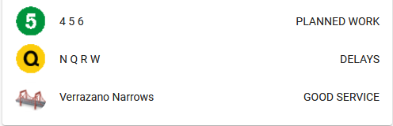
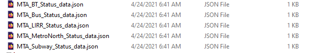

NYC MTA changed structure of the services and website and way service status obtain.

Home Assistant "MTA Service Status" python script

Overview

A python script to provide MTA Service Statuses for Home Assistant. 

The script pull data from the official <a href="https://new.mta.info/planned-service-changes" target="_blank">MTA Service Status</a> feed and create 5 json files.

MTA_BT_Status_data.json cover Bridges and Tunnels: Bronx-Whitestone, Cross Bay, Henry Hudson, Hugh L. Carey, Marine Parkway, Queens Midtown, Robert F. Kennedy, Throgs Neck, Verrazzano-Narrows

MTA_Bus_Status_data.json cover Buses: B1 - B99, B100 - B103, BM1 - BM5, BX1 - BX99, BXM1 - BXM18, M1 - M191, Q1 - Q113, QM1 - QM44, S40 - S98, SIM1 - SIM35, X27 - X68

MTA_LIRR_Status_data.json cover Long Island Rail Road: Babylon, Belmont, City Terminal Zone, Far Rockaway, Hempstead, Long Beach, Montauk, Oyster Bay, Port Jefferson, Port Washington, Ronkonkoma, West Hempstead

MTA_MetroNorth_Status_data.json cover Metro-North Railroad: Hudson, Harlem, Wassaic, New Haven, New Canaan, Danbury, Waterbury, Pascack Valley, Port Jervis

MTA_Subway_Status_data.json cover Subways and Staten island Railway: 123, 456, 7, ACE, BDFM, G, JZ, L, NQR, S, SIR

Installation

Create "data" directory/folder in your Home Assistant configuration directory.

File paths must be added to allowlist_external_dirs:.

Add to configuration.yaml:

    allowlist_external_dirs:
       - /config/data/

Copy all files from data folder to /config/data/

Full path: /config/data/

To install, copy the service_status.py to a directory called python_scripts in your Home Assistant configuration directory.

Full path: /config/python_scripts/

To install the MTA icons, copy the www/icons/mta directory and all files to your Home Assistant configuration directory.

Full path: /config/www/icons/mta/

Use "customize.yaml" in include directory to add "entity_picture" and "friendly_name".

Full path: /config/include/

Add to ui-lovelace.yaml following:

      - type: entities
        title: MTA Service Status
        show_header_toggle: false
        entities:
          - entity: sensor.trains_456
          - entity: sensor.trains_nqr
          - entity: sensor.bus_b1_b84
          - entity: sensor.bridge_verrazano_narrows
